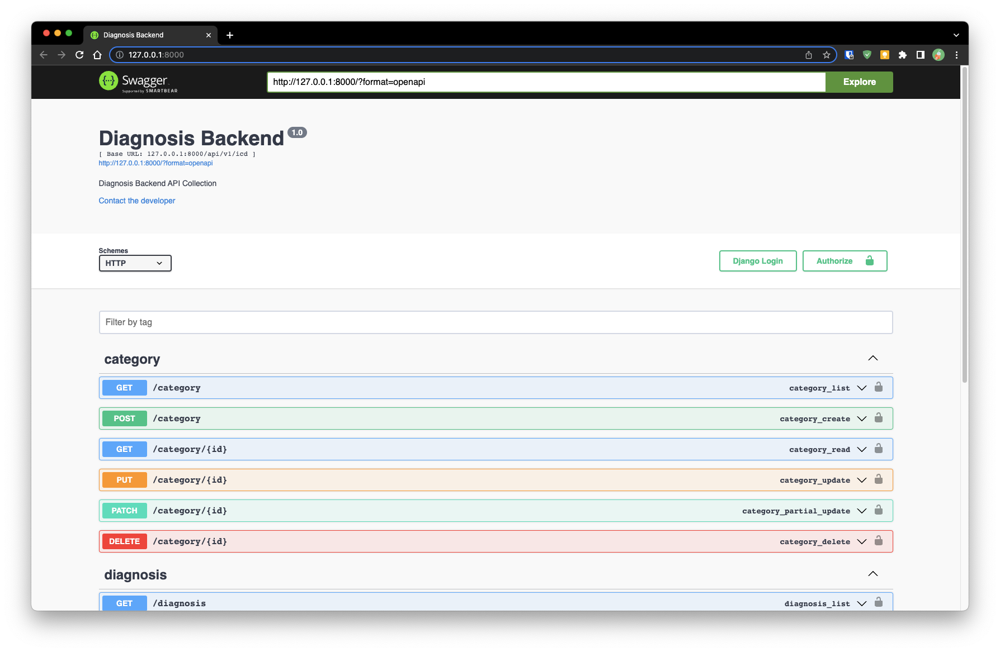

# DJANGO BACKEND WITH POSTGRES AND CELERY

[](https://github.com/horlali/django-docker-postgres-celery/actions/workflows/diagnosis-ci.yml)
[](https://codecov.io/gh/horlali/django-docker-postgres-celery)

Diagnosis backend challenge

## Getting Started

Clone repository to your local and navigate into the folder

```bash
git clone https://github.com/horlali/django-docker-postgres-celery
cd django-docker-postgres-celery/
```

Create the environment file and fill out the variables

```bash
cp .env.example .env
```

Build and start the application with docker-compose

```bash
./script/run-docker.sh
```

You can also add the `-d` flag to run the docker container as a daemon

```bash
./scripts/run-docker -d
```

## Known issues

- Due to the disparity in how windows and linux handle line ending you might run into a line ending error which cause the container to fail on start up. See likely error below.

```bash
diagnosis-api | exec ./scripts/run-server.sh: no such file or directory
```

To fix the error run the following command in the project root.

```bash
sed -i -e 's/\r$//' scripts/*
```

This should fix the issues. Rerun `./script/run-docker.sh --dev` to start the application

## Dev Toolchain

| Tool                                              | Description               |
| :------------------------------------------------ | :------------------------ |
| [Docker](https://www.docker.com/)                 | containerization          |
| [Python ^3.11](https://www.python.org/)           | main programming language |
| [Poetry](https://python-poetry.org/)              | dependency management     |
| [Black](https://github.com/psf/black)             | code formatting           |
| [Isort](https://pycqa.github.io/isort/)           | import sorting            |
| [Flake8](https://flake8.pycqa.org/en/latest/)     | style guide               |
| [Pytest](https://docs.pytest.org/)                | unit testing              |
| [Coverage](https://coverage.readthedocs.io/)      | coverage report           |

## Setup Local Environment

```bash
poetry install
poetry shell
```

## Running tests

In the root of the repository `:~/django-docker-postgres-celery` run the scripts below

```bash
./scripts/run-tests.sh
```

## Running linters

In the `scripts/` folder there are 3 scripts that can be used to check and correct formatting, styling and linting problems `run-black.sh`, `run-flake8.sh`, `run-isort.sh`. The scripts will only check by default, if you would like to correct the errors you need to pass the `--fix` option. If you are using `zsh` and got some errors, consider execution via `bash`

In the root of the repository `:~/django-docker-postgres-celery` run the scripts below

```bash
./scripts/run-black.sh # add --fix flag to fix black formatting issues
./scripts/run-isort.sh # add --fix flag to fix isort linting issues
./scripts/run-flake8.sh
```

or you can simply run all the linters by using the `run-linters.sh` scripts

```bash
./scripts/run-linters.sh # add --fix flag to automatically fix linting and formatting issues
```

## Sample Request and Application Docs

Once the application is up and running, visit <http://127.0.0.1:8000/> or <http://localhost:8000> or in your browser

You should see a Swagger Documentation Page like this


